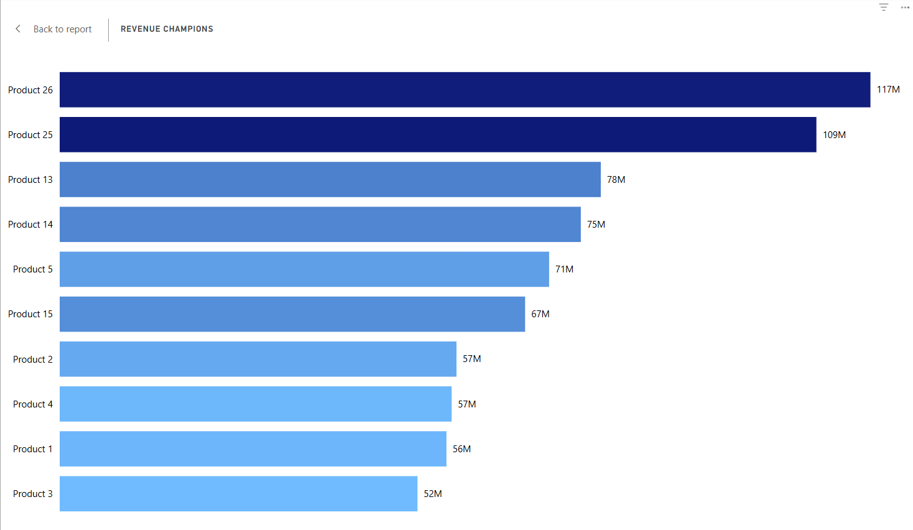

# 📊 Sales Analysis Project

[](https://www.python.org/)
[](LICENSE)


Welcome to the **Sales Analysis Project**!  
This repository provides a comprehensive analysis of sales data to uncover trends, generate insights, and support business decision-making.

---

## ✨ Features

- 📑 **Data Cleaning & Preprocessing**
- 📈 **Visualizations of Key Metrics**
- 🔎 **Exploratory Data Analysis (EDA)**
- 📉 **Trend Analysis & Forecasting**
- 💡 **Actionable Recommendations**

---

## 🛠️ Tech Stack

- **Python** (Pandas, NumPy)
- **Jupyter Notebook**
- **Matplotlib, Seaborn**

---

## 🚀 Getting Started

**1. Clone the repository**
```bash
git clone https://github.com/sneha-purohit/Sales-Analysis-Project.git
cd Sales-Analysis-Project
```

**2. Install dependencies**
```bash
pip install -r requirements.txt
```

**3. Run the analysis**
- Open the relevant Jupyter Notebooks in the `notebooks/` directory  
- Or execute scripts in the `scripts/` directory

---

## 📁 Project Structure

```
Sales-Analysis-Project/
├── data/           # Raw & processed data
├── notebooks/      # Jupyter notebooks
├── scripts/        # Python scripts
├── outputs/        # Visualizations & reports
├── requirements.txt
└── README.md
```

---

## 📊 Example Visualizations

<p align="center">
  
  
</p>

---

## 🤝 Contributing

Contributions and suggestions are welcome!  
Feel free to [open an issue](https://github.com/sneha-purohit/Sales-Analysis-Project/issues) or submit a pull request.

---

## 📄 License

This project is licensed under the [MIT License](LICENSE).

---

## 🧑‍💻 Contact

Questions? Connect with [sneha-purohit](https://github.com/sneha-purohit).

